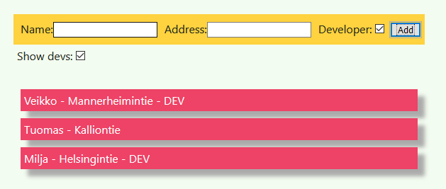

# React frontend example

This frontend works together with [Node.js/MongoDB
backend](https://github.com/veikkos/react-fullstack-backend).



## Usage

You need to first start a backend. Frontend can be then started via

```
npm install
npm start
```

Browser should open to `http://localhost:3000/`. You can use it to add
users to address book. All changes are synchronized to backend and
stored persistently.
