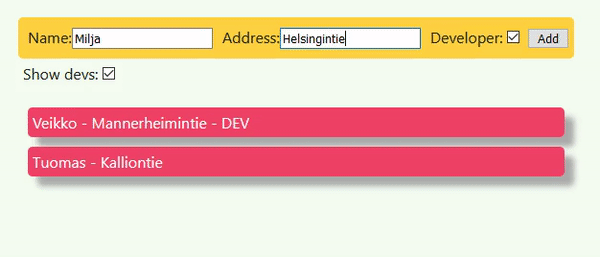

# React frontend example

[](https://github.com/veikkos/react-fullstack-frontend/actions/workflows/node.js.yml)

This frontend works together with [Node.js/MongoDB
backend](https://github.com/veikkos/react-fullstack-backend).



## Usage

You need to first start a backend. Frontend can be then started via

```
npm install
npm start
```

Browser should open to `http://localhost:3000/`. You can use the
frontend to manage users in the address book. All changes are
synchronized to backend and stored persistently. Frontend is localized
in English and Finnish depending on your browser's locale.
